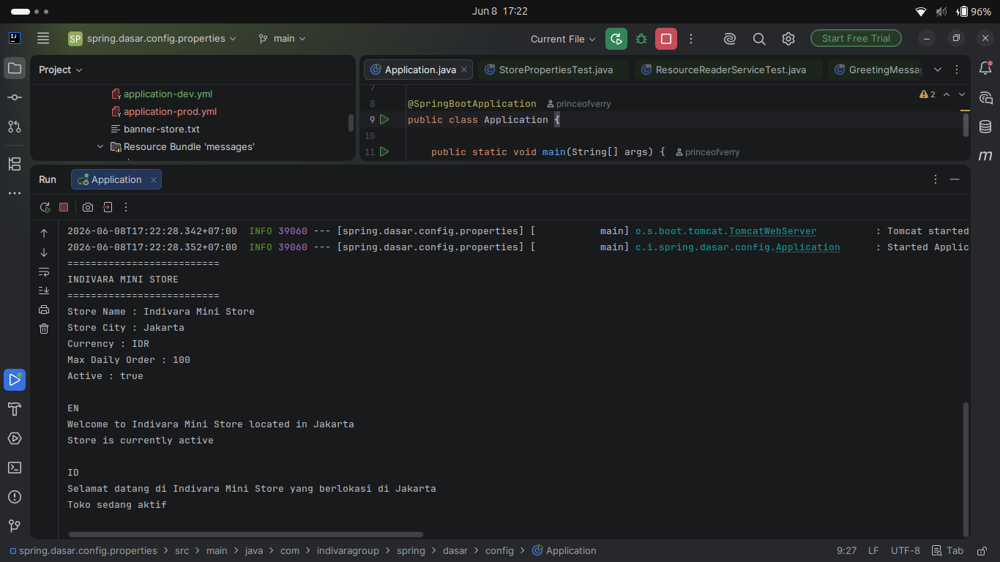
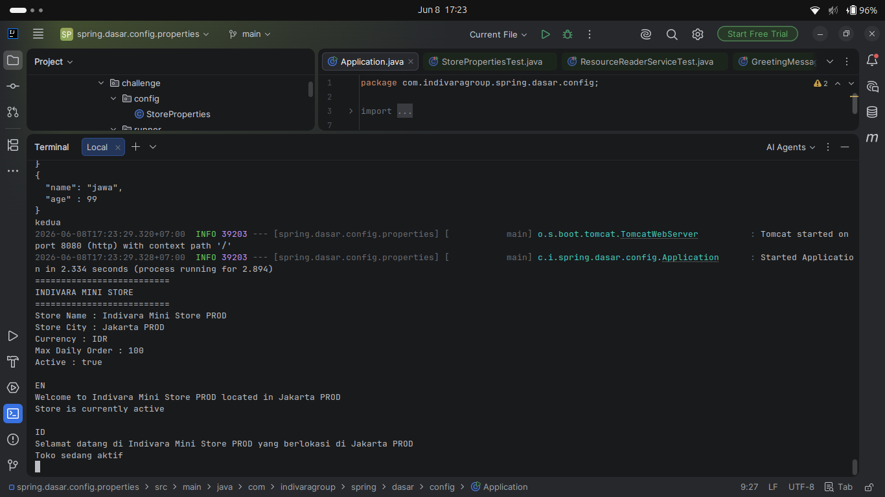
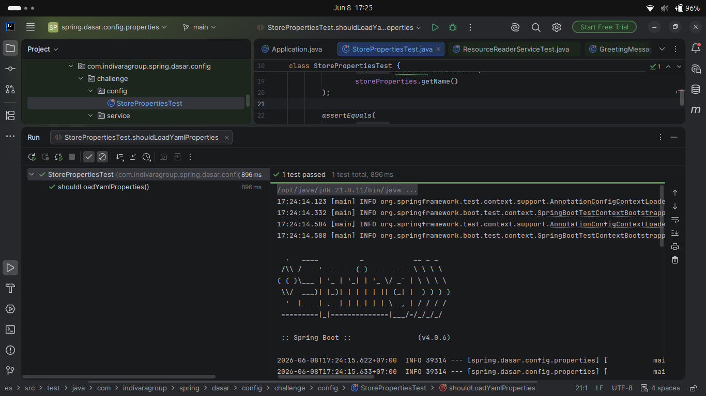
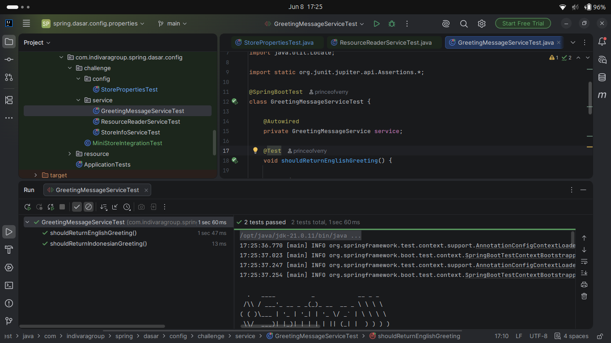
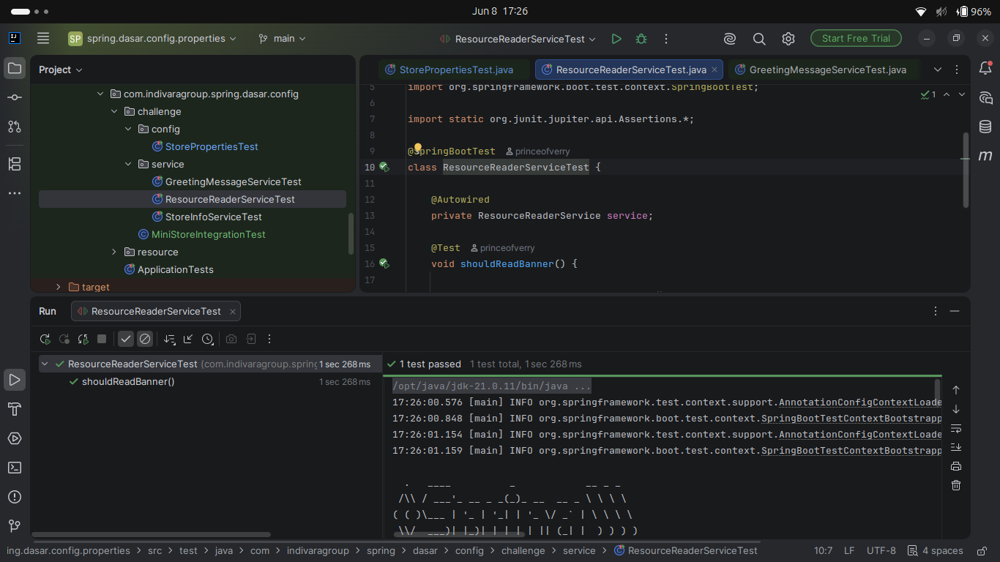
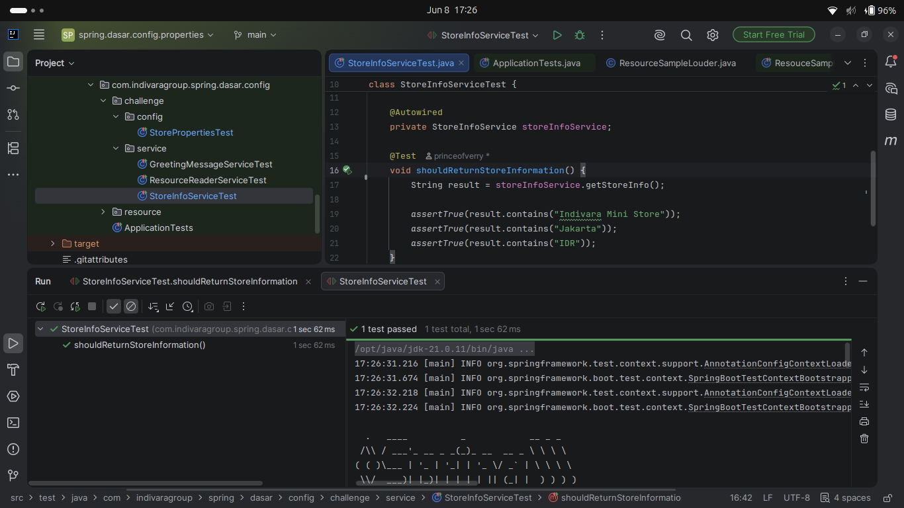

# CHALLENGE 2 SPRINGBOOT
Verry Kurniawan

## Screenshot

### 1. RESULT 1

### 2. RESULT 2

### 3. RESULT 3

### 4. RESULT 4

### 5. RESULT 5

### 6. RESULT 6

### Apa fungsi @ConfigurationProperties?
@ConfigurationProperties digunakan untuk mengambil data dari file konfigurasi seperti application.yml atau application.properties dan menyimpannya ke dalam object Java agar lebih mudah digunakan.

### Apa fungsi ResourceLoader?
ResourceLoader digunakan untuk membaca resource seperti file .txt, .json, gambar, atau file lain yang ada di classpath maupun lokasi lain.

### Apa fungsi MessageSource?
MessageSource digunakan untuk mengambil pesan dari file properties berdasarkan bahasa (locale), sehingga aplikasi dapat mendukung banyak bahasa (internationalization/i18n).